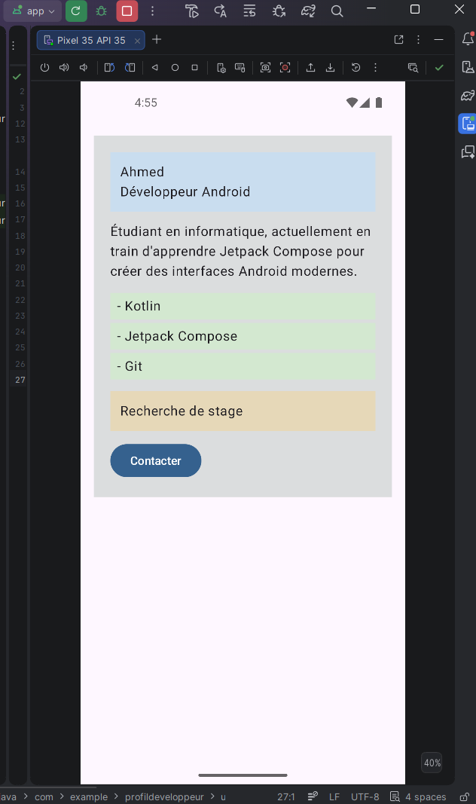
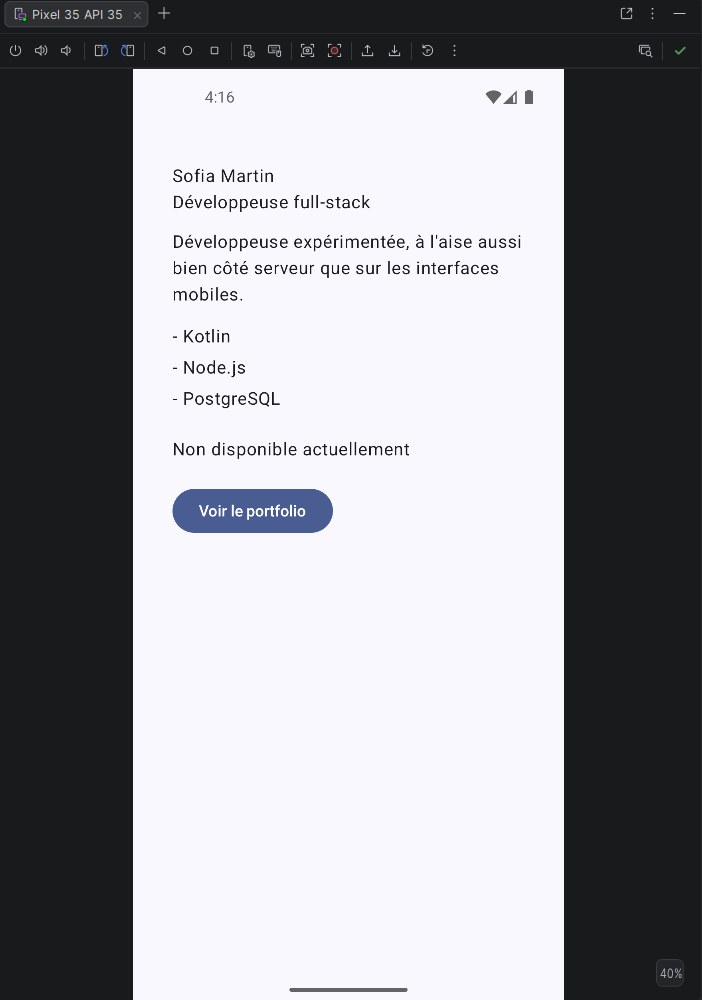

# Profil Développeur Compose

Écran Jetpack Compose affichant une fiche de profil développeur : nom, rôle, courte description,
liste de compétences, disponibilité et action de contact. Réalisé dans le cadre du devoir
« Créer une fiche Profil développeur avec Compose ». L'interface est découpée en
plusieurs composables réutilisables et acceptant des paramètres, avec deux previews montrant
deux profils différents.

## Notions utilisées

- Fonctions composables (`@Composable`)
- Paramètres et composants réutilisables
- `Modifier` et chaînage de modifiers
- Padding externe / padding interne
- Callbacks (événements remontant vers le parent)
- Previews (`@Preview`) avec plusieurs jeux de données
- Accessibilité de base (`clickable(role = Role.Button)`, `semantics { contentDescription }`)

## Structure du projet

```
ProfilDeveloppeur/app/src/main/java/com/example/profildeveloppeur/
├── MainActivity.kt                  # Activity : thème + Scaffold + PageProfil
└── ui/profil/
    ├── PageProfil.kt                # écran principal (padding externe)
    ├── CarteProfil.kt               # fiche assemblée (padding interne) + previews
    ├── IdentiteDeveloppeur.kt       # nom + rôle
    ├── PuceCompetence.kt            # une compétence
    ├── StatutDisponibilite.kt       # zone cliquable personnalisée (accessibilité)
    └── ActionContact.kt             # bouton de contact
```

## Explications

**1. Quels composables avez-vous créés ?**
`PageProfil`, `CarteProfil`, `IdentiteDeveloppeur`, `PuceCompetence`, `StatutDisponibilite` et
`ActionContact`.

**2. Quel composable représente l'écran principal ?**
`PageProfil` : c'est lui que `MainActivity` affiche dans le `Scaffold`.

**3. Où utilisez-vous un padding externe ?**
Dans `PageProfil`, sur le `Column` qui contient `CarteProfil` (`.padding(16.dp)`) : c'est l'écran,
parent de la carte, qui décide de l'espace autour d'elle.

**4. Où utilisez-vous un padding interne ?**
Dans `CarteProfil`, sur le `Column` interne (`Modifier.padding(20.dp)`) : cet espace reste le même
quel que soit l'endroit où la carte est placée par son parent.

**5. Quel composant reçoit un callback ?**
`StatutDisponibilite` et `ActionContact` reçoivent chacun un `onClick: () -> Unit`, transmis par
`CarteProfil` sans qu'elle décide elle-même de la logique déclenchée.

**6. Quelle information d'accessibilité avez-vous ajoutée ?**
`StatutDisponibilite` est une zone cliquable personnalisée (un `Text`, pas un `Button`) : elle
utilise `clickable(role = Role.Button)` pour être annoncée comme un bouton, et
`semantics { contentDescription = "Disponibilité : ..." }` pour décrire l'action à un lecteur
d'écran. `ActionContact` utilise un vrai `Button`, déjà accessible nativement.

**7. Pourquoi vos composants peuvent-ils être considérés comme réutilisables ?**
Aucun n'affiche de donnée figée : chacun reçoit ses valeurs (nom, rôle, compétences, textes,
callbacks) en paramètres et accepte un `modifier: Modifier = Modifier` qu'il applique lui-même,
laissant le parent décider de son placement. Les deux previews ci-dessous le prouvent : les mêmes
composables affichent deux profils entièrement différents.

## Aperçu

| Profil junior (disponible) | Profil full-stack (non disponible) |
|---|---|
|  |  |

> Les deux jeux de données ci-dessus sont aussi visibles directement dans Android Studio via les
> previews `ApercuProfilJunior` et `ApercuProfilExperimente` dans `CarteProfil.kt`.
